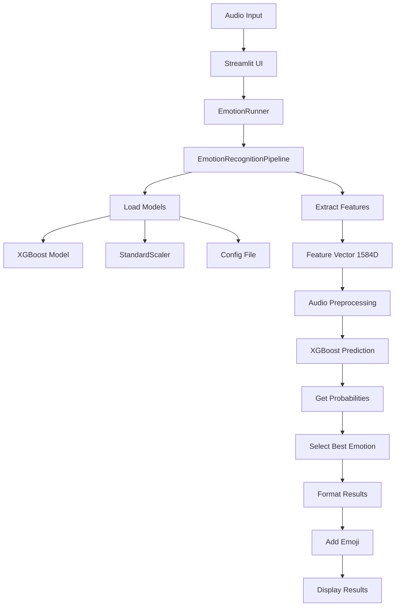

# 🎭 Voice Emotion Recognition System

A real-time voice emotion recognition system that classifies emotions from audio recordings using advanced machine learning techniques and deep audio feature extraction.

---

## 🎯 Problem Statement

Human emotions in speech contain rich information that can be valuable for various applications like customer service, mental health monitoring, education, and AI assistants. However, automatically detecting emotions from voice recordings is challenging due to:

- **Complex Audio Features**: Emotions are encoded in subtle variations of pitch, tone, rhythm, and spectral characteristics
- **Individual Variations**: Different speakers express emotions differently
- **Background Noise**: Real-world audio contains interference
- **Limited Data**: Emotion datasets are often small and imbalanced

---

## 🔧 Our Solution

We developed an end-to-end voice emotion recognition system that:

### 🎵 **Advanced Audio Feature Extraction**

- **MFCC (Mel-Frequency Cepstral Coefficients)** + Delta and Delta-Delta coefficients
- **Mel-Spectrogram** features for frequency domain analysis
- **Spectral Features**: Centroid, bandwidth, rolloff points, flatness, and flux
- **Pitch Analysis**: F0 detection with voiced/unvoiced segmentation
- **Statistical Pooling**: Mean, std, median, quantiles, and temporal slopes across audio frames

### 🤖 **Machine Learning Pipeline**

- **Feature Scaling**: StandardScaler for normalization
- **XGBoost Classifier**: Gradient boosting with GPU acceleration for final deployment
- **Multi-class Classification**: 4 emotion categories (angry, happy, neutral, sad)
- **CPU Inference**: Optimized for real-time deployment

### 💻 **User Interface**

- **Streamlit Web App**: Modern, responsive interface
- **Audio Upload**: Support for .wav files
- **Live Recording**: Real-time audio capture (≤10s)
- **Real-time Results**: Emotion prediction with confidence scores and probability distribution

---

## 📊 Model Performance & Challenges

### **Performance Metrics**

Based on our extensive model comparison (`results/summary.csv`):

| Model                        | Validation Accuracy | Test Accuracy   | F1-Score (Macro) |
| ---------------------------- | ------------------- | --------------- | ---------------- |
| **XGBoost (Deployed)** | 53.4%               | **59.6%** | **58.5%**  |
| Logistic Regression          | **61.8%**     | 53.3%           | 53.0%            |
| SVM RBF                      | 59.3%               | 52.6%           | 51.8%            |
| Random Forest                | 45.6%               | 56.1%           | 54.9%            |
| K-Nearest Neighbors          | 43.5%               | 48.4%           | 46.0%            |

### **Key Challenges & Limitations**

#### 🎯 **Accuracy Limitations (~60%)**

- **Dataset Imbalance**: Some emotions are underrepresented
- **Speaker Variability**: Individual differences in emotional expression
- **Audio Quality**: Recording conditions affect feature extraction
- **Emotion Complexity**: Subtle or mixed emotions are hard to classify

#### 🔍 **Technical Challenges**

- **Feature Dimensionality**: 1,584 features extracted per audio sample
- **Overfitting**: Gap between validation (53%) and test (60%) accuracy suggests model complexity
- **Real-time Processing**: Balancing accuracy with inference speed
- **Generalization**: Model performance varies with unseen speakers and recording conditions

---

## 🔄 Emotion Prediction Flow



### **Detailed Pipeline Steps**

1. **Audio Preprocessing** (`FeatureExtractor.from_path()`)

   - Load audio file using torchaudio
   - Convert stereo to mono
   - Resample to 16kHz (if needed)
   - Apply peak normalization
2. **Feature Extraction**

   - Extract frame-level features using TorchAudio transforms
   - Compute spectral and temporal characteristics
   - Apply statistical pooling across time frames
   - Generate both full-audio and voiced-only statistics
3. **Preprocessing** (`_preprocess_features()`)

   - Apply StandardScaler fitted on training data
   - Ensure feature vector has exactly 1,584 dimensions
4. **Prediction** (`_predict()`)

   - Convert to XGBoost DMatrix format
   - Get probability distribution over 4 emotion classes
   - Return highest probability as predicted emotion
5. **UI Presentation**

   - Display predicted emotion with emoji
   - Show confidence percentage
   - Present detailed probability breakdown

---

## 🏗️ Project Structure

```
machine-learning-project-team4/
│
├── src/                          # Deployment source code
│   ├── feature_extraction_model.py   # Core ML pipeline
│   ├── main.py                       # Emotion runner & orchestration
│   └── ui.py                         # Streamlit web interface
│
├── models/                       # Trained models & artifacts
│   ├── config/config.json            # Audio processing parameters
│   ├── xgb_gpu_hist_1.json           # XGBoost model weights
│   ├── xgb_gpu_hist_1.meta.json      # Model metadata
│   ├── feature_scaler.joblib         # Fitted StandardScaler
│   ├── features_raw/                 # Raw extracted features
│   └── features_scaled/              # Normalized features
│
├── preDeployment/                # Training & experimentation
│   ├── FeatureExtractor.ipynb        # Feature engineering notebook
│   └── modelTraining02.ipynb         # Model training & evaluation
│
├── results/                      # Model performance analysis
│   ├── summary.csv                   # Comprehensive results table
│   └── cm_*.png                      # Confusion matrices for all models
│
└── README.md                     # Project documentation
```

---

## 🚀 Getting Started

### **Installation**

```bash
# Clone the repository
git clone <repository-url>
cd machine-learning-project-team4

# Install dependencies
pip install streamlit xgboost joblib torch torchaudio audio-recorder-streamlit numpy pandas
```

### **Running the Application**

```bash
# Navigate to source directory
cd src

# Launch Streamlit app
streamlit run ui.py
```

### **Usage**

1. **Upload Audio**: Choose a .wav file or record live audio (≤10 seconds)
2. **Analyze**: Click "Analyze emotion" button
3. **View Results**: See predicted emotion, confidence score, and probability distribution

---

## 👥 Team Members

- **Azzam Al-Jariwi**
- **Raghad Al-Ghamdi**
- **Rawaa Sarti**
- **Maimouna Al-Awla**
- **Ziyad Al-Harbi**

---


## 📈 Technical Specifications

- **Audio Processing**: 16kHz sampling rate, 25ms windows, 10ms hop
- **Feature Dimension**: 1,584 features per audio sample
- **Model Type**: XGBoost with CPU predictor
- **Inference Time**: <1 second for 10-second audio clips
- **Supported Formats**: WAV files, live microphone input
- **Emotion Classes**: 4 classes (angry, happy, neutral, sad)

---
